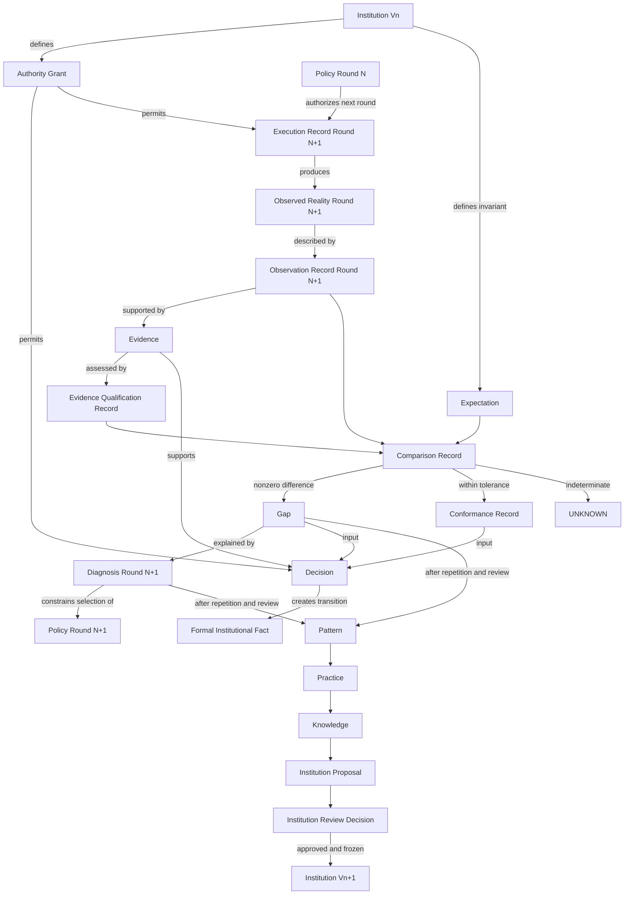

# CR-0001 第二轮对象一致性审查

## 审查信息

```text
Review ID: CR-0001-R2
Review Type: Object Graph Consistency Review
Status: COMPLETED
Result: PASS_WITH_BLOCKERS
Executable: NO
Reviewed Proposal: CR-0001
Source Conversation: 6a6ecde3-0aa4-83ee-a53c-7c707fbf57f2
Source Review Turn: a05fddca-3a06-43ff-8371-7cf51955d498
Source Review Output: 0bc76425-d88d-4db7-9df7-c2639607fe27
```

> 本文件是对象级审查记录，不是制度冻结。`PASS_WITH_BLOCKERS` 只表示提案可以继续审查，不表示可以进入运行时或取代既有制度。

## 审查问题

本轮只回答以下问题：

1. 每个节点究竟是对象、角色、过程、关系、状态还是正式事实？
2. 每个正式对象是否只有一个逻辑所有者？
3. 每个正式对象是否只承担一个目的？
4. 每个正式对象实例是否只引用一个适用权威？
5. 对象之间是否存在反向权威、循环定义或职责重叠？

## 总体结论

`CR-0001` 已经具备继续正式审查的资格，但对象图尚不能冻结。当前存在六项阻断条件：

1. 候选计算与正式事实登记尚未完全分离；
2. 非零但可接受的差异无法由二元分支正确表达；
3. 现实、观察和正式现实尚未分层；
4. `Decision` 尚无独立冻结模型；
5. `Claim` 的适用范围与所有者尚不唯一；
6. 既有原则的取代关系尚未逐条声明。

## 类型分类

对象图中的节点必须先归类。不同类型不能因为画在同一张图中就被视为具有相同生命周期。

| 类型 | 定义 | 候选成员 |
|---|---|---|
| 宪法对象 | 拥有独立身份、生命周期和制度语义 | `Institution`、`Authority Grant`、`Expectation`、`Evidence`、`Gap`、`Diagnosis`、`Policy`、`Decision` |
| 运行时记录 | 记录一次具体运行时行为或推导 | `Execution Record`、`Observation Record`、`Comparison Record`、`Conformance Record` |
| 角色 | 执行职责但不因能力天然拥有权威 | `Observer`、`Evidence Qualifier`、`Comparator`、`Decision Maker`、`Executor` |
| 过程 | 消费输入并产生候选记录或决策 | `Evidence Qualification`、`Comparison`、`Institution Review` |
| 值对象 | 只能依附于所属对象，没有独立权威 | `Tolerance`、`Difference`、`Relation`、`Confidence`、`Severity` |
| 状态 | 表达对象当前处境，不是独立事实类型 | `UNKNOWN`、`FAILURE`、`SUSPENDED`、`SUPERSEDED` |
| 抽象命题 | 可被证据支持或削弱，但不自动成为事实 | `Claim` |

### 分类裁决

- `Comparator` 是执行角色，不是基础层宪法对象。
- `Comparison` 是过程；`Comparison Record` 才是可保存对象。
- `Relation` 是 `Comparison Record` 的值，不是独立状态机。
- `Tolerance` 属于 `Expectation`，不是 `Gap` 的所有物。
- `Decision` 是基础层对象；具体选择、验收、发布和冻结属于它的类型。
- `Claim` 暂不准入基础层，直到其范围、所有者和事实边界能够唯一化。

## 对象关系图

下图是审查后的候选图，不是冻结模型。



版本与轮次后缀是对象审查要求：`Policy Round N` 只能授权下一轮执行，`Institution Vn+1` 只能取代而不能反向修改 `Institution Vn`。删除后缀会制造看似自我推导的循环。

## 三个现实层次

目前文档中的 `Reality` 同时指物理发生、观察记录和制度承认，容易产生循环。候选模型必须拆成三个层次：

```text
Observed Reality
  -> Observation Record
  -> Formal Institutional Fact
```

- `Observed Reality`：已经发生的世界，不由制度创造，也没有仓库所有者。
- `Observation Record`：主体对现实某一部分的可追踪记录，可能不完整或错误。
- `Formal Institutional Fact`：经权威、证据和决策合法建立的制度事实。

`Decision` 只能改变正式制度现实，不能反向改变已经发生的观察现实。

## 对象唯一性矩阵

这里的“所有者”是逻辑真源，不是某次运行时 Agent。“权威”是对象实例成立或迁移时必须引用的唯一适用授权；没有决策权的候选计算明确标记为无。

| 对象 | 唯一逻辑所有者 | 唯一目的 | 适用权威 | 结论 |
|---|---|---|---|---|
| `Institution` | 制度注册表 | 保存冻结不变量及版本 | 制度冻结权威 | `PASS` |
| `Authority Grant` | 权威注册表 | 声明主体对对象的合法操作边界 | 治理授权权威 | `PASS` |
| `Expectation` | 预期注册表 | 定义成功、观察范围和容差 | 预期权威 | `PASS` |
| `Execution Record` | 执行注册表 | 记录一次被授权执行 | 执行权威 | `PASS` |
| `Observation Record` | 观察注册表 | 描述现实的一个可观察方面 | 观察记录权威 | `PASS` |
| `Evidence` | 证据账本 | 保存支持观察或事件的不可变依据 | 证据记录权威 | `PASS` |
| `Evidence Qualification Record` | 证据资格注册表 | 判断证据是否满足制度准入条件 | 证据资格权威 | `PASS` |
| `Comparison Record` | 比较注册表 | 记录预期与观察之间的差异及关系 | 比较认证权威 | `PASS_WITH_BLOCKER` |
| `Conformance Record` | 符合注册表 | 记录差异是否处于预期容差内 | 符合认证权威 | `PASS_WITH_BLOCKER` |
| `Gap` | 偏差注册表 | 保存一项预期与观察之间的非零差异 | 偏差登记权威 | `PASS` |
| `Diagnosis` | 诊断注册表 | 保存对一个偏差的可修订因果解释 | 诊断登记权威 | `PASS` |
| `Policy` | 策略注册表 | 授权或终止下一次运行时行动 | 策略选择权威 | `PASS_WITH_BLOCKER` |
| `Decision` | 决策账本 | 记录有权主体实际作出的状态迁移裁决 | 每个实例引用一个领域决策权威 | `PASS_WITH_BLOCKER` |
| `Pattern` | 模式注册表 | 聚合重复事实关系 | 模式审查权威 | `PASS` |
| `Practice` | 实践注册表 | 保存经重复验证的可复用做法 | 实践批准权威 | `PASS_WITH_BLOCKER` |
| `Knowledge` | 知识注册表 | 保存跨执行上下文稳定成立的经验 | 知识批准权威 | `PASS` |
| `Institution Proposal` | 制度提案注册表 | 提出候选制度变更 | 提案提交权威 | `PASS` |
| `Institution Review Decision` | 决策账本 | 批准、拒绝或退回制度提案 | 制度审查权威 | `PASS` |
| `Claim` | 尚未确定 | 表达可被支持或反驳的命题 | 尚未确定 | `FAIL` |

## 争议一：Comparator

### 结论

`Comparator` 应存在，但只能作为执行层角色，不应成为基础层对象。

### 原因

基础层定义比较契约和不变量；执行层定义由哪个组件履行角色。把角色直接提升为基础对象会违反 `I-11` 的分层边界。

候选职责：

```text
Comparator
Can:
  compute Difference
  compute candidate Relation
  emit candidate Comparison Record
Cannot:
  certify Comparison Fact
  create Conformance Fact
  create Gap Fact
  accept or reject
  modify Expectation or Observation
```

比较候选记录要成为正式记录，必须经过独立的比较认证权威。角色能力不能替代正式事实成立权威。

## 争议二：Relation

### 结论

`Comparison` 应输出 `Difference` 与 `Relation`，但 `Relation` 不是生命周期状态。

候选枚举：

```text
CONFORMS
DOES_NOT_CONFORM
INDETERMINATE
```

当关系为 `INDETERMINATE` 时，必须同时记录原因：

```text
INSUFFICIENT_EVIDENCE
NON_COMPARABLE
UNDEFINED_SCOPE
```

单独使用 `INSUFFICIENT_INFORMATION` 作为全部未知情况，会把证据不足、不可比较和范围缺失压缩成同一个原因。

## 争议三：Tolerance 与 Gap

### 结论

`Tolerance` 只能属于冻结的 `Expectation`。`Gap` 引用适用容差版本，但不得拥有或修改容差。

```text
Expectation owns Tolerance
Comparison computes Difference
Conformance evaluates Difference against Tolerance
Gap records nonzero Difference
```

### 推翻二元分支

以下分支不充分：

```text
MATCH -> Conformance
MISMATCH -> Gap
```

原因是非零差异可能仍处于容差内。例如预期目标为 `5.0`、观察为 `5.02`、容差为 `±0.05`：

- `Difference` 非零，因此存在 `Gap`；
- 差异处于容差内，因此同时存在 `Conformance Record`；
- 后续验收仍需要独立 `Decision`。

候选合法路径为：

```text
Difference = 0
  -> Conformance

Difference != 0 AND within Tolerance
  -> Gap + Conformance

Difference outside Tolerance
  -> Gap + Nonconformance

Difference cannot be established
  -> INDETERMINATE
```

这保留了 `G-11`“偏差可以被接受”的既有原则，也避免容差反向删除偏差历史。

## 争议四：Decision

### 结论

`Decision` 应进入基础层并独立成章。

`Authority`、`Decision` 和 `Policy` 必须保持分离：

```text
Authority -> who may decide
Decision -> what was decided
Policy -> what future execution is authorized
```

每个决策实例只能引用一个主要决策权威，但可以引用多个证据、事实和候选主张。

候选决策类型：

```text
Selection Decision
Acceptance Decision
Publication Decision
Override Decision
Policy Selection Decision
Institution Review Decision
Institution Freeze Decision
```

`Decision` 创造正式生命周期迁移，不证明决策“正确”，也不能修改观察现实和历史证据。

## 争议五：Evidence Qualification

### 结论

采用 `Evidence Qualification`，暂不采用 `Evidence Certification`。

`Qualification` 只判断证据是否满足制度准入条件：

```text
QUALIFIED
DISQUALIFIED
INSUFFICIENT
```

它不判断现实是否真实、不解释原因，也不决定业务对象是否通过。`Certification` 容易被误解为已经给予最终真实性保证。

证据资格结论本身是正式结论，必须引用规则版本、检查记录、资格权威和审计证据。

## 争议六：Claim

### 结论

`Claim` 是有价值的抽象，但本轮拒绝将其直接冻结为独立基础对象。

### 拒绝原因

当前 `Claim` 至少可能同时承担三个目的：

1. 表达诊断原因假设；
2. 表达制度提案主张；
3. 表达决策理由中的一般命题。

它没有唯一所有者，也没有唯一生命周期。立即加入基础层会违反本轮“一对象一目的”的审查条件。

### 保留方案

暂时把 `Diagnosis` 明确视为一种受治理的“解释性主张”，但不改变其现有对象身份。后续若建立独立 `Claim Model`，必须先回答：

- 哪些命题有资格成为 `Claim`；
- 谁可以创建、修订、撤回和取代；
- 证据是支持、反驳还是仅相关；
- `Claim` 如何与事实严格分离；
- `Diagnosis`、`Institution Proposal` 是否是子类型；
- `Claim` 是否永远不能直接创建正式事实。

## Policy 与 Decision 的边界

当前 `P-01` 把所有未来行动交给策略，范围过宽。候选边界应为：

```text
Lifecycle Decision
  -> changes formal object state

Policy Selection Decision
  -> selects a Policy

Policy
  -> authorizes next runtime execution

Governance Decision
  -> reviews or freezes Institution
```

策略不得控制制度提案、制度审查或制度冻结；普通验收、选择和发布也不必伪装成补救策略。

## 正式事实成立路径

既有公式仍然成立：

```text
Authority + Evidence + Decision = Formal Fact
```

但需要增加候选计算边界：

```text
Execution Role
  -> Candidate Record
  -> Qualification or Certification Decision
  -> Formal Fact
```

因此：

- `Comparator` 产生候选比较记录；
- 比较认证决策建立正式比较记录；
- 正式比较记录可以支持符合事实或偏差事实；
- 验收决策、选择决策和发布决策分别建立对应生命周期事实。

任何计算结果都不得因为算法是确定性的就自动获得制度权威。

## 对象职责失败检查

| 检查对象 | 潜在双重职责 | 裁决 |
|---|---|---|
| `Verification` | 同时进行证据资格、比较和最终验收 | 必须拆分，`FAIL` |
| `Policy` | 同时授权运行时行动和普通生命周期裁决 | 必须收窄，`FAIL` |
| `Comparison` | 同时计算差异和建立正式事实 | 必须区分候选计算与认证，`FAIL` |
| `Conformance` | 同时表达符合关系和自动接受 | 禁止自动接受，修正后 `PASS` |
| `Gap` | 同时记录差异和拥有容差 | 容差归预期后 `PASS` |
| `Claim` | 同时表示诊断、提案和一般主张 | 暂缓准入，`FAIL` |
| `Decision` | 同时被误当作权威或策略 | 独立建模后可 `PASS` |

## 对现有冻结制度的影响

本轮只提出修订映射，不直接修改正文。

| 现有原则 | 所需动作 | 原因 |
|---|---|---|
| `A-03` | 正式取代或修订 | 角色能力、授权和执行混写 |
| `A-04` | 正式取代或修订 | 选择生命周期被错误写成线性链 |
| `E-05` | 正式取代 | 硬预期偏离不得自动产生失败 |
| `E-10` | 澄清 | `Tolerance` 已属于预期，但需成为显式值对象 |
| `G-01`、`G-03` | 扩展引用 | 需要插入正式比较记录 |
| `G-11` | 保留 | 非零偏差与符合事实可以共存 |
| `P-01`、`P-03` | 正式取代或收窄 | 策略只控制未来运行时执行 |
| `EV-07`、`EV-14` | 澄清 | 候选计算与正式事实登记必须分离 |
| `I-11` | 保留 | 支持角色与基础对象分层 |
| `I-12` | 保留 | 要求术语最终只能定义一次 |

## 下一轮正式审查的最低输入

进入冻结设计前，必须先产生以下独立提案：

1. `Decision Model`；
2. `Comparison and Conformance Model`；
3. `Evidence Qualification Boundary`；
4. `Policy Scope Amendment`；
5. `Authority Operation Matrix Amendment`；
6. `Reality Layer Clarification`。

`Claim Model` 暂不进入上述顺序，除非它能够通过唯一所有者、唯一目的和唯一权威审查。

## 最终裁决

```text
Proposal Structure: PASS
Object Graph Completeness: FAIL
Authority Separation: FAIL
Purpose Uniqueness: FAIL
History Preservation: PASS
Provider Independence: PASS
Domain Portability: PASS
Freeze Readiness: FAIL
```

建议动作：保留 `CR-0001` 为草案，把本审查作为第二轮正式审查记录；独立决策模型第一修订版已经建立，见 [`CR-0002_R1_DecisionModel.md`](./CR-0002_R1_DecisionModel.md)。在其通过审查前，不冻结、不修改现有七章。
